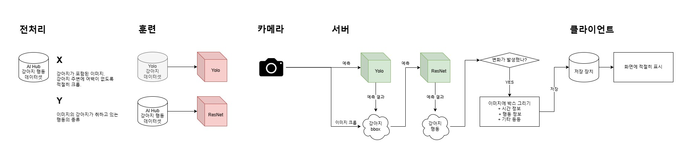

# 2월 18일 회의록🐶
작성: `박주형`

### 프로젝트 진행 단계
- [x] 주제설정
- [x] 데이터셋 수집 및 분석
- [ ] 데이터셋 전처리
  - [ ] 데이터셋 가공🏃‍➡️
  - [ ] 데이터셋 정제
- [ ] 모델 학습
- [ ] 모델 최적화 및 평가
- [ ] 앱 개발
  - [ ] UI 개발🏃‍➡️
  - [ ] 추론 파이프라인 개발
- [ ] 발표자료 작성
- [ ] 프로젝트 발표 및 평가

---

### 파이썬 버전 통일
* 3.13.1 버전 사용<br>
<br>

### 프로젝트 도식화 
</img><br>
<br>

### YOLO - COCO 데이터셋 사용
* 강아지 객체 탐지

### 파트 별로 나눠서 작업
**데이터 전처리(강아지 행동 분류)팀**
1. 진행한 작업
    * ResNet 모델을 학습시키기 위한 데이터 준비(X: 크롭된 이미지, Y: 행동 유형)
        + AI-Hub 데이터셋(반려동물 구분을 위한 동물 영상) 원천 데이터 이미지 크롭, 행동 유형 추출 Python 코드 구조 구상
2. 주요 논의 사항
    * JSON 파일 구조 및 필요한 데이터 파악
        + "metadata" 의 "action" 값 -> 행동 유형 -> CSV에 저장
        + "annotations" 의 "bounding_box" 값 -> 크롭에 사용
    * 데이터셋 폴더 구조 및 압축 파일 해제 방법(수동/코드)
    * CSV 파일 생성 및 헤더 구성
    * 라벨 데이터 JSON 파일에서 원천 데이터 이미지 프레임 넘버와 일치하는 프레임만 처리
        + 원천 데이터 '동영상 폴더명'과 이미지 파일명에서 '프레임 넘버' 딕셔너리로 추출
        ```
        # 예시
            "동영상 폴더명" : "20201118_dog-bodyscratch-002894.mp4"
	        "이미지 파일명" : "frame_12_timestamp_400.jpg"
        ```
        + JSON 파일에서 일치하는 프레임의 "bounding_box" 값 추출
    * OpenCV를 사용하여 이미지 크롭
    * 크롭된 이미지, CSV 파일 저장
    
3. 추가 고려 사항
    * 원천 데이터 용량이 커서 압축 해제하는 데 3시간 걸림
        + 폴더 한 개 압축 해제 후 작업 완료되면 삭제하는 식의 방법 고려
    * ResNet 모델 훈련을 위한 데이터 형식, 크롭 이미지 리사이징 필요 유무<br>
    <br>
---
<br>

**UI 팀**
1. 진행한 작업
    * Streamlit 기반 UI 개선
        * 기존 use_column_width 파라미터가 use_container_width로 변경되면서 발생한 경고 메시지를 해결.
        * 실시간 감지 영상이 표시될 공간을 video_placeholder로 설정하고, 향후 웹캠 연동 시 쉽게 적용할 수 있는 코드 구조화.
    * ResNet 모델을 활용한 실시간 감지 인터페이스 구축
        * 현재는 랜덤 데이터를 활용하여 감지 결과를 표시하고 있으며, 이후 모델이 연동되면 실시간으로 반영되도록 설계.
        * 클라이언트 단독 실행과 서버-클라이언트 방식 중 어떤 방식이 더 효율적인지 논의함
    * 탭 구조 정리 및 UI 레이아웃 구성
        * 라이브, 로그, 알림, 설정 네 개의 탭으로 정리하여 기능을 명확히 구분
        * 라이브 탭: 실시간 감지 화면 및 현재 감지된 동작 표시
        * 로그 탭: 감지된 행동 이력 데이터프레임 형태로 제공
        * 알림 탭: 사용자가 특정 포즈를 선택하면, 감지 시 알람이 발생하도록 설정
        * 설정 탭: 도움말/FAQ 제공 및 추후 기능 추가를 고려
2. 주요 논의 사항
    * 서버-클라`이언트 방식 vs. 로컬 실행 방식 비교
        * 로컬 실행 시 사용자의 기기 성능에 따라 모델 속도가 달라질 수 있으나, 네트워크가 불안정한 환경에서도 동작 가능
        * 서버-클라이언트 방식의 경우 모델 업데이트가 용이하고 데이터 수집 및 개선이 가능하나, 네트워크 연결이 필수적이고 서버 운영 비용 발생
        * 현재는 로컬 실행을 우선 테스트하되, 추후 클라우드 기반 배포도 고려
    * 알림 기능 설정 개선
        * 사용자가 원하는 포즈를 선택하면, 감지될 경우 실시간으로 경고 메시지를 띄우도록 개선
        * 현재는 감지 시 st.session_state.alerts에 기록되며, 추후 알림이 사용자에게 더 직관적으로 전달되도록 디자인 변경 논의
    * 설정 탭 내 도움말 추가
        * 기본적인 사용 방법과 FAQ를 제공하여 처음 사용하는 사용자도 쉽게 이해할 수 있도록 함
        * UI 구조와` 기능별 설명을 포함한 가이드를 추가할 예정
3. 추가 고려할 사항
    * UI 배포 방식 결정
        * 로컬에서만 실행할지, 웹 기반으로 배포할지 결정 필요
    * 실시간 감지 성능 최적화 및 스트림 처리 방법
        * 현재는 랜덤 데이터를 활용한 감지 결과를 표시 중이므로, 실제 ResNet 모델과 연결할 시 프레임 속도와 처리 속도 고려 필요
    * 디자인 요소 개선 및 사용자 피드백 반영
        * 버튼 스타일, 알림 표시 방식, 데이터 시각화 방법 개선 검토<br>
<br>


### 프로젝트 발표 공지
- 9시부터 19시까지 진행 예정 (18시 X)
    * 9시 출석 호명
    * 13시까지 팀 별로 리허설 및 준비
    * 14시부터 7시까지 발표

- 팀 당 10분 + QnA 심사 위원 당 한 개 정도 질문
    - 발표 인원 3명 이상 (추천)
